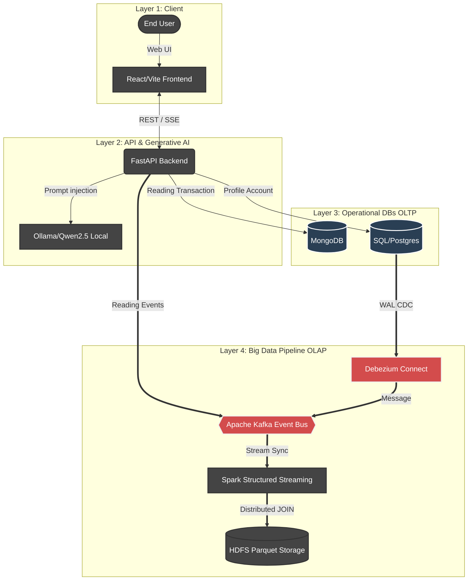
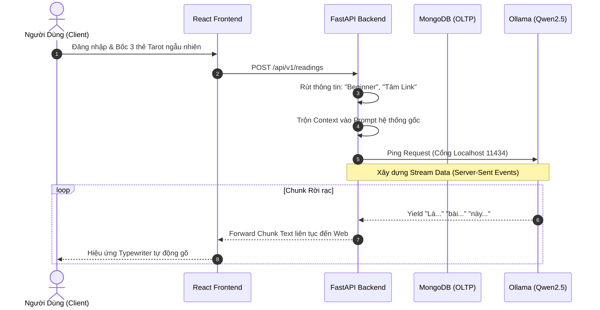
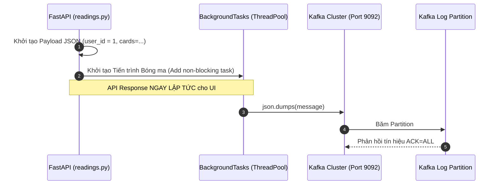
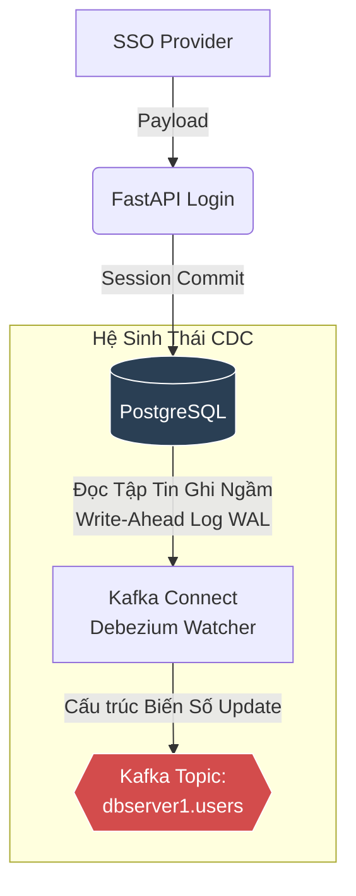
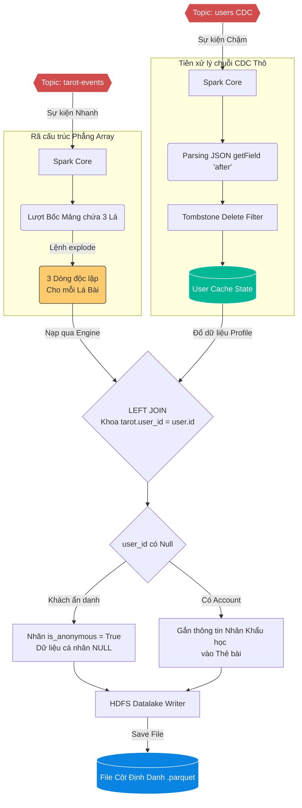

# TÓM TẮT (ABSTRACT)
Nghiên cứu này trình bày kiến trúc phân tán toàn diện (Microservices) nhằm xây dựng một Hệ thống Tarot cá nhân hóa ứng dụng Trí Tuệ Nhân Tạo (Generative AI - LLM). Điểm đột phá của hệ thống nằm ở việc thiết kế Tách biệt Dịch vụ (Decoupling) giữa Hệ thống Giao dịch Trực tuyến (OLTP) và Hệ thống Phân tích Dữ liệu Lớn (OLAP) thông qua mô hình Event-Driven. Bằng cách áp dụng **Change Data Capture (CDC)** qua quy trình Debezium PostgreSQL và mẫu thiết kế Bất đồng bộ (Async Outbox) với Apache Kafka, khung xử lý luồng **Apache Spark Structured Streaming** có khả năng ghép nối phân tán (Distributed In-Memory JOINs) để lưu trữ bền vững xuống HDFS. Giải pháp Phân tích Đám mây Cục bộ (Local Qwen2.5 1.5B qua Ollama) hoàn thiện hóa dự án bằng cách loại bỏ độ trễ và chi phí API, đáp ứng các tiêu chuẩn khắt khe về kỹ nghệ Dữ Liệu Lớn chuyên nghiệp.

---

# 1. ĐẶT VẤN ĐỀ VÀ MỤC TIÊU
## 1.1 Tính cấp thiết của hệ thống
Trong các hệ thống phân tích tâm lý phức tạp, dữ liệu người dùng được thu nạp liên tục. Cơ sở dữ liệu nguyên gốc (MongoDB/PostgreSQL) chỉ được thiết kế cho luồng Đọc/Ghi cực nhanh dành cho Ứng dụng. Việc các kỹ sư Phân tích Dữ liệu quét toàn bộ bảng CSDL để huấn luyện lại Mô hình AI hoặc vẽ Report Tableau tạo ra **Nút thắt cổ chai (Bottleneck)** dẫn tới sập server trên diện rộng.

## 1.2 Nhược điểm của Mạng LLM Đám mây
Các hệ thống phụ thuộc hoàn toàn vào OpenAI bộc lộ 3 nhược điểm:
1. Chi phí Token (Token-cost) tỷ lệ thuận phi mã với lượng User lớn.
2. Bài toán Rate Limit của API bên thứ ba.
3. Độ trễ sinh mạng liên kết (Network Latency) gây đứt gãy luồng văn bản Trực tiếp (Streaming).

## 1.3 Mục tiêu Cốt lõi
Khai sinh kiến trúc **Zero-Impact Streaming**: Trích xuất, tiền xử lý và nạp (ETL Pipeline) toàn bộ hồ sơ trải bài và siêu số liệu người dùng trong Thời gian thực bằng thuật toán Event Bus (Kafka) + Spark mà **TUYỆT ĐỐI KHÔNG** làm suy giảm năng lực phục vụ giao diện người dùng (UI) đang chạy.

---

# 2. KIẾN TRÚC PHÂN TÁN VÀ LUỒNG DỮ LIỆU ĐA CHIỀU (ARCHITECTURE)

Hệ thống được ứng dụng mô hình Microservices với 4 tầng (Layer) rõ rệt. Độc giả vui lòng xem xét luồng lưu chuyển sau:

---

# 3. CHUYÊN ĐỀ KỸ THUẬT: ĐIỀU PHỐI AI VÀ MẪU THIẾT KẾ XỬ LÝ SỰ KIỆN

Phần này đi sâu vào giải phẫu mã nguồn (Codebase) bằng các sơ đồ kỹ thuật chi tiết để minh chứng tính năng Bất đồng bộ hóa (Asynchronous) ở Tầng Tương tác Ứng dụng.

## 3.1 Vòng đời Sinh Văn Bản Tâm Linh (LLM SSE Streaming)
Khi người dùng bốc bài, hệ thống không sử dụng dữ liệu tĩnh mà áp dụng kỹ thuật **Pre-context Prompt Injection**.

**Nhận xét Học thuật:** Hệ thống Qwen2.5 Local giúp luồng Server-Sent Event đẩy chuỗi Byte xuyên suốt không hề có độ trễ qua cổng 11434, trong khi CSDL MongoDB xử lý việc ghim phiên làm việc (Session Saving).

## 3.2 Mẫu Thiết Kế Asynchronous Fire-And-Forget (Đẩy Kafka)
Trong các nền tảng Hệ thống Phân tán, nếu đợi đẩy xong khối Big Data mới trả kết quả, UX của User sẽ tê liệt. Backend thực hiện triệt để mô hình **Event-driven Outbox**.

**Nhận xét Học thuật:** Tiến trình BackgroundTasks hoạt động độc lập giải phóng vòng lặp (Event Loop) của HTTP Request. Bằng thiết lập `ACK=ALL`, Broker tự động đồng bộ chéo phân vùng (Partition Replica) đảm bảo khối sự kiện Thẻ Bài 100% nằm an toàn trên Đĩa cứng trước khi Thread sập.

---

# 4. CHUYÊN ĐỀ KỸ CƠ SỞ: LUỒNG CHANGE DATA CAPTURE VÀ SPARK STREAMING

## 4.1 Bắt dính RDBMS mà không cần Query bằng Debezium
Khi User Đăng nhập qua OAuth2 Google, nếu hệ thống truy vấn Database SQL liên tục để đồng bộ kho Big Data sẽ dẫn tới Lock Bảng.

**Nhận xét Học thuật:** Cơ chế Debezium là điệp viên tầng ổ cứng. Nó quét giao thức mạng ảo logical decoding của Postgres WAL. Khi 1 trường "Cấp độ kinh nghiệm" bị chỉnh sửa, nó nhả 1 gói tin lên Kafka theo định dạng: `{"before": "beginner", "after": "master", "op": "u"}`, đạt độ vẹn toàn Database cao nhất.

## 4.2 Tuyệt kỹ Khớp Nối Phân Tán In-Memory Của Apache Spark
Trái tim của hệ thống phân tích nằm ở Khối Tác vụ `tarot_streaming.py`. Spark Structured Streaming vận hành Micro-batch mỗi 5 giây để Gộp nhào (Denormalize) dữ liệu Bốc bài thô với Dữ liệu Thông tin cá nhân.

**Sự xuất sắc của Spark trong Kiến trúc Này:**
1. **Lệnh `explode()`**: Khử tính lồng nhau của Array JSON. Trả Mảng 3 lá bài về thành 3 Vector phẳng để Công cụ Trực quan hóa Biểu đồ sau này đếm chéo (Count) cực nhanh.
2. **Loại bỏ Tombstone (Xóa Trống)**: Lọc sạch các gói tin Xóa User để bộ Cache Spark không bị ô nhiễm.
3. **Thuật toán LEFT JOIN linh hoạt**: Cho phép hệ thống đo lường cả những Khách truy cập web nặc danh (User ID = Null). Thay vì làm mất/lọc bỏ dữ liệu nặc danh này ra khỏi mạng Kafka, cơ chế Spark vẫn bảo tồn gói tín hiệu bốc bài để bổ sung tính toàn vẹn vào kho `HDFS Parquet`. 

---

# 5. CẤU TRÚC LƯU TRỮ COLUMNAR FILE (PARQUET) TẠI KHO LẠNH HADOOP

Khung xử lý kết xuất ra tập tin `Parquet` mã nguồn mở nền tảng Cột (Columnar). Lợi ích vượt trội của Parquet đối với dự án:
Việc Spark nén kết quả bằng Parquet cho phép các hệ truy vấn Ad-hoc (như Presto hay Apache Superset) chỉ đọc duy nhất các Sector đĩa chứa cột cần phân tích (ví dụ quét 100% cột "Lá Bài Nhận Được" mà không load cột "Text AI Dài") -> Bớt mài mòn Cấu trúc Ổ đĩa IOPS so với định dạng CSV/JSON cũ.

---

# 6. KẾT LUẬN

Hệ thống AI Tarot Kỷ nguyên mới chứng thực tiềm lực tích hợp Big Data song song luồng sinh dữ liệu Deep Learning. Đồ án giải quyết dứt điểm tính chậm trễ rào cản I/O của hạ tầng truyền thống bằng một thiết kế Decoupling Đa tiến trình, định danh dữ liệu luân chuyển tự do từ App qua Mạng Lưới Message Queue Kafka để bồi đắp Hồ Nước Dữ liệu HDFS lạnh - một nền tảng quy chuẩn công nghiệp chuẩn bị cho các đợt huấn luyện Máy (Machine Learning Fine-tuning) thế hệ tiếp theo.
