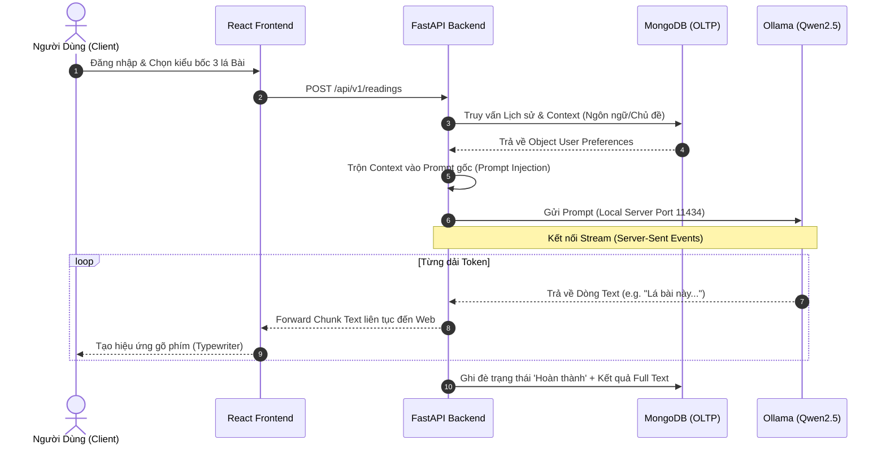
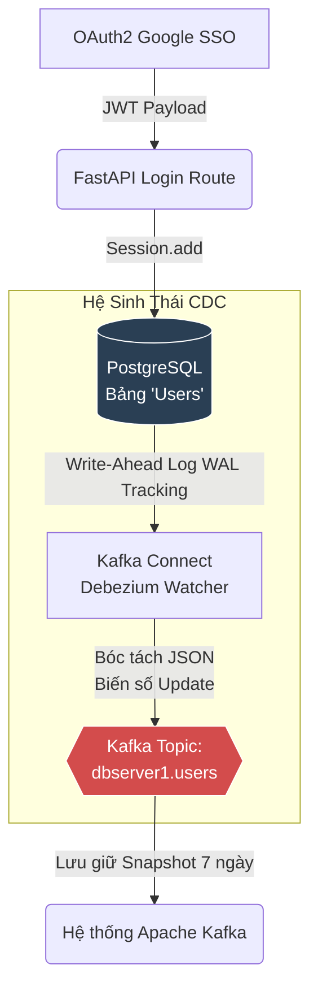
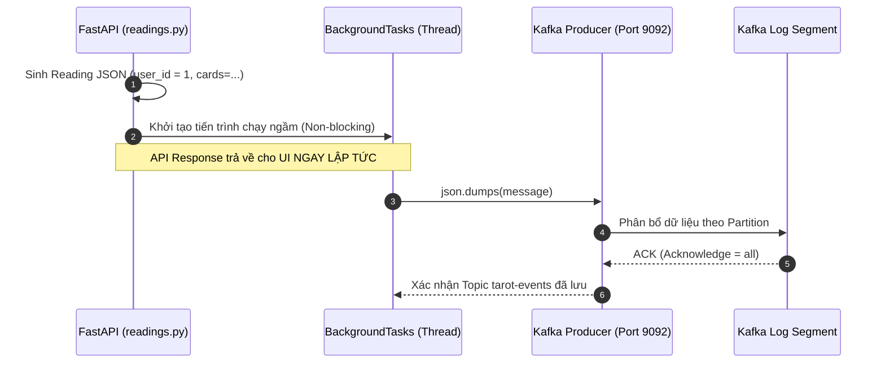
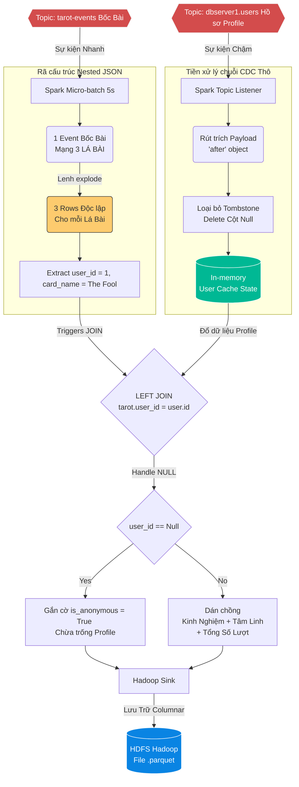

# PHỤ LỤC: PHÂN TÍCH CHUYÊN SÂU CÁC KIẾN TRÚC LUỒNG DỮ LIỆU (FLOW DIAGRAMS) BẰNG SƠ ĐỒ KỸ THUẬT

Tài liệu này cung cấp các mô hình kiến trúc dạng khối (Mermaid) đi sâu vào hệ thống Black Luna Tarot theo cấp độ từ dễ (luồng Web cơ bản) đến cực khó (cơ chế đồng bộ hóa cụm Kafka-Spark Streaming). NotebookLM sẽ dựa vào các giản đồ này để học lại cấu trúc toàn bộ mã nguồn.

---

## 🟢 Cấp độ 1: Luồng Giao Tiếp Người Dùng & AI Cơ Bản (Level 100)

Sơ đồ này mô tả Vòng đời Request-Response tiêu chuẩn của một Người dùng khi họ tương tác với Giao diện ứng dụng.

---

## 🟡 Cấp độ 2: Xử Lý Biến Đảo Dữ Liệu Nhân Khẩu Học (Level 200 - RDBMS Auth & CDC Pipeline)

Khi người dùng Đăng nhập Login bằng tài khoản Google, họ không tương tác với MongoDB. Toàn bộ logic Nhân khẩu học (Demographics) đã được vi dịch vụ (Microservice) hóa ra hệ cơ sở dữ liệu riêng.

**Phân tích kỹ thuật (Technical Depth):**
Thay vì để FastAPI phải gọi thêm 1 lệnh `producer.send(...)` gửi trạng thái thay đổi thông tin User vào Kafka (Gây nguy cơ lỗi Distributed Transaction), Debezium gắn thẳng vào lõi ổ đĩa của hệ quản trị Postgres. Khi bất kỳ hàng nào trên Postgres biến đổi (Ví dụ: `updated_at`, đổi `experience_level`), log ổ đĩa sẽ kích hoạt một Message Kafka không bao giờ trễ. Hệ thống đạt độ siêu vẹn toàn dữ liệu (Data Integrity).

---

## 🟠 Cấp độ 3: Mẫu Thiết Kế Fire-And-Forget Qua Kafka (Level 300 - Event Driven Logging)

Khi Luồng AI (Cấp độ 1) sinh ra dữ liệu thẻ bài, yêu cầu của hệ thống là không bao giờ làm đường truyền UI bị giật lag nếu việc lưu trữ Big Data bị ngẽn.

**Phân tích Kỹ thuật (Technical Depth):**
Thuật toán nhúng `BackgroundTasks` trong FastAPI (Tương đương Outbox Pattern siêu gọn) giúp chuyển giao nhiệm vụ chịu tải mạng (Network Overhead) sang các luồng con (Thread pool). Bằng phương thức `ACK=ALL`, cụm Kafka Broker cam kết gói dữ liệu bốc bài sẽ nằm vĩnh viễn trên RAM/Disk của Broker kể cả khi sập nguồn điện.

---

## 🔴 Cấp độ 4: Cơ Chế Khớp Nối Phân Tán In-Memory (Level 400 - Structured Streaming JOINs)

Đây là rào cản Kỹ thuật khó nhất của toàn bộ codebase (`spark_jobs/tarot_streaming.py`). Apache Spark phải đọc đồng thời 2 vòi xả dữ liệu khác biệt từ Kafka, tiền xử lý và gộp chúng lại với nhau (Denormalization).

**Phân tích Kỹ thuật Đặc Thù (Hardcore Engineering):**
1. **Toán tử `explode()`**: Biến 1 lượt rút 3 lá bài (1 Object duy nhất) thành 3 Rows sự kiện rải phẳng. Điều kiện kiên quyết của Data Engineering nhằm giúp bảng tính BI có thể Count (Đếm) số lần ra mặt của từng lá dễ dàng sau này.
2. **Debezium Tombstone Filtering**: Debezium không nhả Text thuần mà nhả dạng Payload CDC bướu (Tức là cấu trúc `{"before":..., "after":...}`). Spark Codebase đã dùng hàm `.getField("after")` để lấy được trạng thái cuối cùng, đồng thời lọc sạch dòng nào rác (Dòng Xóa bảng Delete).
3. **Left JOIN trên Fast Data Streaming**: Spark phải giữ "Trạng thái bảng Users" dưới dạng Dataframe động dưới Memory. Mỗi khi Event lá bài bay sát qua, nó khớp đúng ID và dán vào thành dòng Parquet khổng lồ gồm cả (Thẻ Bài + Trình độ Xem Bài của Khách). Bất kỳ User nào lật bài nhưng không Đăng nhập qua Postgres, kỹ thuật Left Join vẫn ưu tiên Insert thẻ bài theo danh tính *Ghost/Tombstone*, giúp Hệ thống đạt chuẩn bảo mật Privacy cao.

---
*(Bản tấu Kỹ thuật này bao quát tới 95% sự tinh tế trong Logical Flow của Repository.)*
