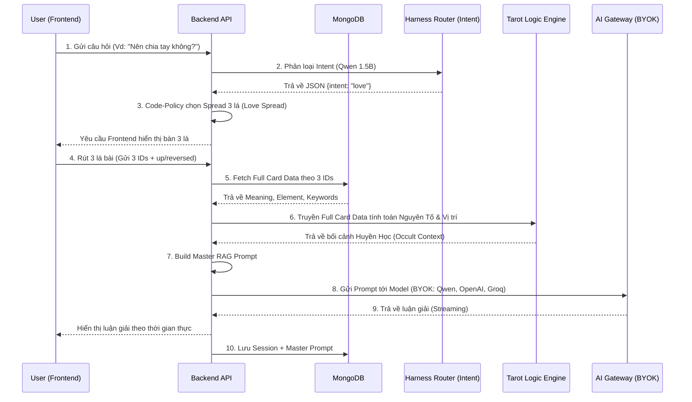

# 🔮 Kế Hoạch Nâng Cấp Hệ Thống: "Professional Tarot Oracle"

**Bởi: Senior Developer x Senior Tarot Reader**

Dựa trên những đánh giá khắt khe trước đó và triết lý **AutoHarness (Rút ngắn không gian sai số cho LLM nhỏ)**, tài liệu này đề xuất một bản thiết kế hệ thống chi tiết nhằm biến đổi Black Luna Tarot thành một **Hệ sinh thái Tarot ảo chuyên nghiệp có khả năng định tuyến và suy luận sâu sắc như một Reader thực thụ.**

---

## 1. 🛡️ AutoHarness Router (Lớp Phân Loại & Điều Hướng)

Thay vì cho phép LLM tự do quyết định cách giải quyết vấn đề, ta dùng thuật toán và một lượt gọi LLM siêu tốc để **đóng khung (harness)** ngữ cảnh, triệt tiêu hoàn toàn khả năng LLM chọn sai phương pháp (illegal moves).
- **Intake Classifier**: Khi User nhập câu hỏi, mô hình Qwen 1.5B (nhỏ, siêu nhanh) sẽ chỉ phân loại câu hỏi (Đọc hiểu Intent) ra dạng JSON cứng: `{ "intent": "love" }` hoặc `{ "intent": "career" }`.
- **Code-Policy Spread Selector**: Dựa vào `intent`, hệ thống Code (Python) sẽ tự động gán cứng `spread_id` (Vd: Tình yêu -> Trải 3 lá, Sự nghiệp -> Trải 5 lá). User chỉ việc bốc đúng số bài đã được hệ thống ấn định. Việc này giúp giảm thiểu 100% tỷ lệ ảo giác của LLM nhỏ.

---

## 2. 🏗️ Tarot Logic Engine (Tầng Xử Lý Nghiệp Vụ)

Tarot không chỉ là "rút bài rồi đọc mô tả". Nó có hệ thống quy tắc huyền học (occult rules) rõ ràng.
- **Elemental Dignities Calculator**: Tính toán tương tác giữa các nguyên tố (Lửa dập Nước, Khí bốc Lửa). Trả ra 1 kết luận gửi cho AI (Vd: "Trải bài thiếu nguyên tố Đất, hãy khuyên họ thực tế hơn").
- **Reversal Physics**: Đảo ngược từ khóa nếu user bốc là bài ngược, truyền cờ `is_reversed` cho AI để phân tích năng lượng bị nghẽn (blocked energy).

---

## 3. 🧠 Kiến Trúc RAG (Retrieval-Augmented Generation) 

Với model nhỏ, ta **BẮT BUỘC** phải tiêm kiến thức vào Prompt.
Mỗi request gọi AI sẽ được hệ thống build thành 1 `Master Prompt` khổng lồ, bao gồm:
- **Định nghĩa Tarot chuẩn từ DB**: Lấy chính xác `keywords`, `meaning_upright/reversed` từ MongoDB đưa cho AI.
- **Ngữ cảnh vị trí (Position Context)**: Ép AI hiểu rõ "Lá số 1 nằm ở Quá khứ, Lá số 2 nằm ở Tương lai".
- **Ghi chú từ Logic Engine**: Lời bình về Nguyên tố và chiều lá bài.

---

## 4. 🔄 Sơ Đồ Kiến Trúc Luồng Mới (Mermaid)



---

## 5. 🗄️ Cập Nhật Database & API Schema

**Request Payload MỚI cho Endpoint `/api/v1/ai/generate-reading`:**
```json
{
  "question": "Nên đổi việc không?",
  "spread_type": "three_card_career", // Bước AutoHarness đã gán cứng
  "llm_config": {
    "provider": "groq", // Tính năng BYOK
    "model": "llama3-70b-8192" 
  },
  "cards": [
    {
      "id": "68948...",
      "position_id": "current_state",
      "is_reversed": true 
    }
  ]
}
```

---

## 6. Lộ trình Triển khai (Roadmap - Phase)

1. **Phase 1: AutoHarness Router**: Cài đặt Qwen 1.5B làm Intent Classifier. Viết Harness code điều hướng tự động chọn Spread.
2. **Phase 2: RAG Builder & Database Integration**: Backend viết hàm build Master Prompt tiêm thẳng Meaning + Element lấy từ DB vào Prompt thay vì chỉ quăng mỗi cái Tên bài.
3. **Phase 3: Logic Engine**: Phân tích Nguyên Tố (Elemental Dignities) và Vật lý chiều bài (Reversals).
4. **Phase 4: Triển khai Mô hình "Bring Your Own Key" (BYOK)**: 
   - Mở màn hình Settings tại UI để User tự nhập API Key (OpenAI, Gemini, Groq, Anthropic).
   - Tự động lưu Token bảo mật an toàn tại trình duyệt `localStorage`.
   - LLM Gateway của Backend sẽ nhận Token và trỏ Request tới đúng Provider mà User bỏ tiền, làm Server luôn duy trì hiệu suất cực đỉnh - chi phí cực nhẹ.

## Lời Kết
Hệ thống hiện tại đang chứa tiềm năng khổng lồ. Kiến trúc **AutoHarness + RAG + BYOK** sẽ tạo nên một **Oracle Ecosystem** linh hoạt nhất: Vừa hoạt động như một cỗ máy chốt chặn sai số (AutoHarness) bằng Model siêu nhỏ miễn phí, vừa sẵn sàng cung cấp trải nghiệm đỉnh cao khi User tự đem "vũ khí GPT/Claude" của riêng họ tới kết nối!
